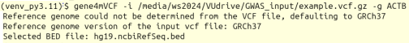
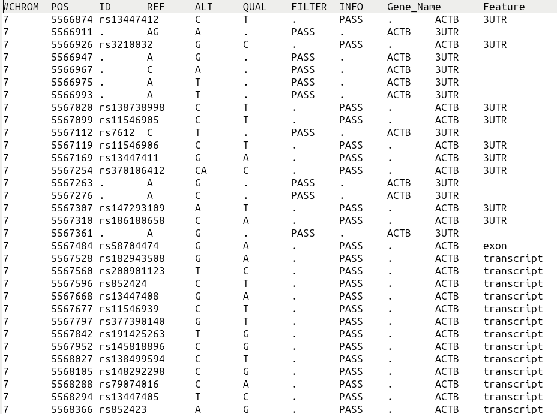

# gene4mVCF

## Introduction
`gene4mVCF` is a Python package that allows you to extract variant entries for specific genes or a list of genes from a VCF (Variant Call Format) file. It utilizes tools like `bcftools`, `tabix`, and Python libraries like `pysam`, `pandas`, `pybedtools`, `tqdm`, and `gffutils` to efficiently parse and extract variants.

## Installation

You can install `gene4mVCF` via pip:

`$ pip install gene4mVCF`

After installation please download the four required bed files and place inside the folder /gene4mVCF
 'hg19.ensGene.bed' --> https://hgdownload.soe.ucsc.edu/goldenPath/hg19/bigZips/genes/hg19.ensGene.gtf.gz  
 'hg19.ncbiRefSeq.bed' --> https://hgdownload.soe.ucsc.edu/goldenPath/hg19/bigZips/genes/hg19.ncbiRefSeq.gtf.gz  
 'hg38.ensGene.bed' --> https://hgdownload.soe.ucsc.edu/goldenPath/hg38/bigZips/genes/hg38.ensGene.gtf.gz  
 'hg38.ncbiRefSeq.bed'--> https://hgdownload.soe.ucsc.edu/goldenPath/hg38/bigZips/genes/hg38.ncbiRefSeq.gtf.gz  

## Usage
Extract variant entries for a specific gene or list of genes from a VCF file.
 usage: `$ gene4mVCF [-h] -i INPUT -g GENE` 

Needed arguments:
  `-i INPUT, --input INPUT is bgzip compressed VCF file` 
  `-g GENE, --genes GENE is either a Gene name, Ensembl gene ID, or path to a genelist file` 

 optional arguments: 
    `-h, --help  show this help message and exit` 
  
## Examples
Extract variants for a single gene using gene name:
`$ gene4mVCF -i input.vcf.gz -g EGFR`

Extract variants for a single using ensembl gene id:
`$ gene4mVCF -i input.vcf.gz -g ENSG00000168878`

Extract variants for multiple genes listed in a file:
`$ gene4mVCF -i input.vcf.gz -g genes.txt`

For more options and details, refer to the help message.

**Example showing extraction of variants of ACTB gene**

 input command 

 Output file in the tab-separated format 

## Support
For any issues or inquiries, please open an issue on the GitHub repository https://github.com/VJ-Ulaganathan/gene4mVCF

## Installation

Installation via pip:

`$ pip install gene4mVCF`

